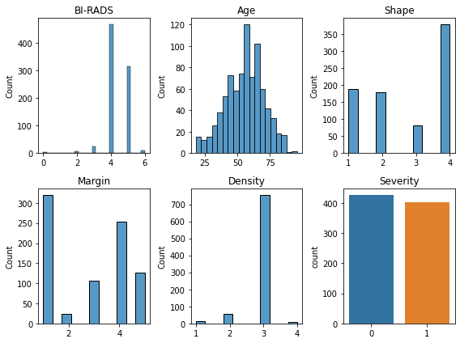
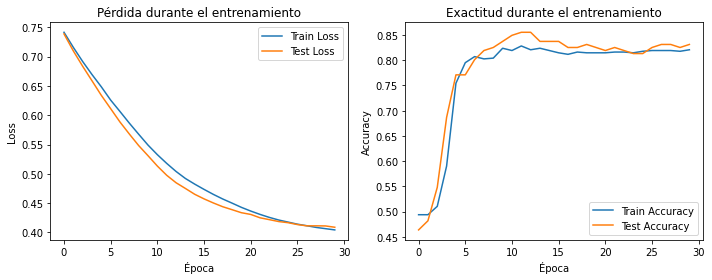
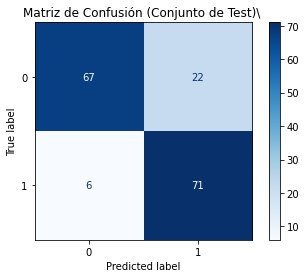

# Mammography Classification Project

Este repositorio contiene un análisis exploratorio de datos (EDA) y modelos de machine learning para clasificar la severidad de masas mamográficas (benigno vs. maligno) basado en el dataset Mammographic Mass (UCI). El objetivo es predecir la variable `Severity` utilizando características como BI-RADS, edad, forma, margen y densidad.

El análisis se realiza en un notebook de Jupyter (`mammography_classification_LZR.ipynb`), donde se incluyen limpieza de datos, visualizaciones, entrenamiento de modelos (regresión logística, árbol de decisión, random forest y red neuronal con PyTorch) y evaluación de rendimiento.

## Descripción
El dataset contiene 830 registros con 6 características:
- **BI-RADS**: Evaluación radiológica (0-6).
- **Age**: Edad del paciente.
- **Shape**: Forma de la masa (1-4).
- **Margin**: Margen de la masa (1-5).
- **Density**: Densidad de la masa (1-4).
- **Severity**: Severidad (0: benigno, 1: maligno).

Se realiza un EDA completo, escalado de datos, división train/test (80/20), y entrenamiento de múltiples modelos. El mejor rendimiento se obtiene con el método de la Regresión Logística (accuracy ~84% en test), aunque todos los modelos superan el 80%.

## Objetivo
Predecir si una masa mamográfica es benigna o maligna para asistir en diagnósticos médicos tempranos, utilizando técnicas de clasificación supervisada.

## Requisitos
Para ejecutar el notebook, necesitas las siguientes dependencias.

- Python 3.8+
- pandas
- numpy
- matplotlib
- seaborn
- scikit-learn
- torch (PyTorch)

## Cómo Ejecutar
1. Clona el repositorio: 

git clone https://github.com/lazar-hbar/mammography-classification.git
cd mammography-classification

2. Asegúrate de tener el dataset `Mamografias.csv` en la raíz del proyecto.
3. Instala las dependencias:

Ejecuta el notebook: mammography_classification_LZR.ipynb

- Asegúrate de tener Jupyter instalado (`pip install jupyter`).
- El notebook carga el CSV, realiza EDA y entrena modelos automáticamente.

## Estructura del Proyecto
- `mammography_classification_LZR.ipynb`: Notebook principal con código, ejecuciones, gráficos y resultados.
- `Mamografias.csv`: Dataset de entrada (incluido o descarga desde [UCI ML Repository](https://archive.ics.uci.edu/dataset/161/mammographic+mass)).
- `requirements.txt`: Lista de dependencias.
- `README.md`: Este archivo.
- `LICENSE`
- Imágenes/Gráficos: Generados en el notebook (ej. matriz de confusión, curvas de pérdida).

## Resultados
- **EDA**: No hay valores nulos. La edad media es ~55 años. Distribución de severidad equilibrada (~51% benigno, 49% maligno).
- Ejemplo de gráfico: Distribución de edades.
  <!-- Agrega la imagen real al repo y actualiza el path -->

- **Modelos Evaluados**:
- Regresión Logística: Accuracy ~84% (con GridSearchCV).
- Árbol de Decisión: Accuracy ~82% (con GridSearchCV).
- Random Forest: Accuracy ~83% (con GridSearchCV).
- Support Vector Machine (SVM): Accuracy ~83% (con GridSearchCV).
- XGBoost: Accuracy ~81% (con GridSearchCV).
- Red Neuronal (PyTorch): Accuracy ~83% en test (mejor generalización).
 - Curvas de entrenamiento:
    <!-- Agrega la imagen -->
 - Matriz de Confusión (Red Neuronal):
    <!-- Agrega la imagen -->
 - Reporte de Clasificación (Regresión Logística):
								       precis   recall    f1-score   support

							   0       0.88      0.82        0.85         89
							   1       0.81      0.87        0.84         77

				  accuracy                                    0.84       166
			   macro avg       0.84       0.85        0.84       166
		  weighted avg       0.85       0.84        0.84       166

 - Reporte de Clasificación (Red Neuronal):
 
									   precis   recall   f1-score   support

							   0       0.92      0.75      0.83          89
							   1       0.76      0.92      0.84          77
							   
				   accuracy                                0.83         166
				macro avg       0.84      0.84      0.83         166
		   weighted avg       0.85      0.83      0.83         166
 
 - **Conclusiones**: La red neuronal y Regresion Logistica destacan en recall para casos malignos (clase 1), clave para aplicaciones médicas. Posibles mejoras: Aumentar datos o usar técnicas de oversampling.

## Autor
- Lazar (@eleazarheviat)
- Contacto: eheviatorres@gmail.com

## Licencia
- **Código del notebook**: Licencia MIT © [Lazar/2025]
- **Dataset**: Mammographic Mass Data Set – UCI Machine Learning Repository (dominio público, se solicita citar la fuente: https://archive.ics.uci.edu/dataset/161/mammographic+mass)

¡Si tienes sugerencias o mejoras, abre un issue o pull request! 